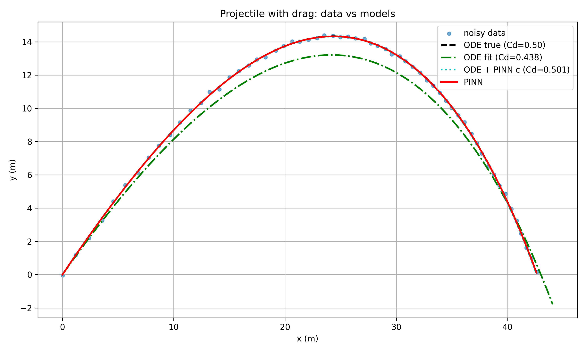

# Physics-Informed Neural Networks vs. Classical ODE Fitting

**Recovering an unknown drag coefficient from noisy projectile data.**

Given noisy position measurements of a projectile subject to air resistance, can
a Physics-Informed Neural Network (PINN) recover the unknown drag coefficient
more reliably than classical least-squares fitting of the governing ODE?

**Result: yes — by a wide margin.** The PINN recovered a drag coefficient within
**0.25%** of ground truth; classical least-squares fitting was off by **12.4%**.

Developed as an IB Extended Essay in HL Physics. Full write-up:
[`docs/extended_essay.docx`](docs/extended_essay.docx).



---

## Background

Classical mechanics models solve ODEs derived from Newton's second law. They are
precise and interpretable, but they require every force and coefficient to be
known in advance — and in practice, quantities like a drag coefficient are
exactly what you *don't* know. Purely data-driven models fit observations but
can drift away from physical consistency, especially where data is sparse.

A PINN sits between the two. The governing ODE is embedded directly into the
training loss via automatic differentiation, so the network is penalized for
violating Newton's laws at every point in the domain — not just where data
exists. Unknown physical parameters can be treated as trainable variables and
learned jointly with the trajectory.

## Problem setup

A tennis ball is launched and tracked under quadratic drag, `F_d = c·v²`, where
`c = ½·C_d·ρ·A`.

| Parameter | Value |
|---|---|
| Mass | 0.057 kg |
| Diameter | 0.067 m |
| Launch speed | 30 m/s at 45° |
| Air density | 1.225 kg/m³ |
| True drag coefficient | C_d = 0.5 |
| Observations | 60 points, Gaussian noise (σ_x = 0.05 m, σ_y = 0.08 m) |

The governing system, with state `[x, y, ẋ, ẏ]`:

```
ẍ = −(c/m)·v·ẋ
ÿ = −g − (c/m)·v·ẏ        where v = √(ẋ² + ẏ²)
```

Ground-truth trajectories are generated with `solve_ivp` at `rtol=1e-9`, then
corrupted with noise to simulate measurement. Both methods see only the noisy
data and must infer `c` from it.

## Methods

### Baseline — classical parameter fitting

Forward-simulate with `scipy.integrate.solve_ivp`, then recover `c` with
`scipy.optimize.least_squares`. Two details matter:

- The fit is performed in **log-space** (`c = exp(log_c)`), which enforces
  positivity without a constrained optimizer.
- Initial velocities are estimated from a linear fit to the first few noisy
  points — a realistic assumption, since in a real experiment you wouldn't know
  them exactly. This is also the baseline's main weakness, as the results show.

### PINN

A 3×128 fully-connected network with `tanh` activations, mapping `t → (x, y)`.
`tanh` is chosen deliberately: the physics residual needs **second** derivatives
of the network output, and ReLU has a vanishing second derivative, which would
make the physics loss meaningless.

The loss has three terms:

| Term | Weight | Purpose |
|---|---|---|
| `L_data` | 1.0 | MSE against the noisy observations |
| `L_phys` | 1.0 | Residual of the drag ODE, from autograd 2nd derivatives |
| `L_ic` | 10.0 | Initial position and velocity constraints |

`L_ic` is upweighted because only **four** scalars constrain the initial state,
against 60 data points and 60 collocation points. At equal weighting the
optimizer has little incentive to satisfy them exactly, and the trajectory
drifts from the known launch conditions.

**Learning the drag coefficient.** `c` is a trainable parameter, but drag must
physically be positive — a negative value would mean the ball accelerates
*forward* due to air resistance. Rather than constrain the optimizer, `c` is
reparameterized through softplus:

```python
self.c_raw = nn.Parameter(torch.tensor(-7.0))

def c_phys(self):
    return torch.nn.functional.softplus(self.c_raw)
```

`softplus` maps ℝ → ℝ⁺ smoothly, so gradient descent can move `c_raw` freely
while the physical value stays positive. Initializing at `−7.0` gives
`softplus(−7) ≈ 9×10⁻⁴`, i.e. near-zero drag — the network first learns the
approximate free-fall shape, then discovers drag as training proceeds.

**Two-stage optimization.** Adam for 3000 epochs, then L-BFGS for 200
iterations. Adam adapts per-parameter learning rates and handles the messy early
loss landscape well, but oscillates near the minimum. L-BFGS uses curvature
information to converge precisely, but tends to fail from a random
initialization. Adam gets close; L-BFGS polishes.

The training curve shows exactly why both are needed:


The loss drops roughly six orders of magnitude, but note the instability spikes
after ~epoch 2200 — Adam bouncing around the minimum rather than settling into
it. That is the behaviour the L-BFGS stage exists to clean up.

## Results

Metrics computed against the noisy observations:

| Model | Recovered C_d | Error vs. true | RMSE (total) | R² (mean) |
|---|---|---|---|---|
| ODE, true `c` *(reference)* | 0.5000 | — | 0.0877 | 0.99985 |
| ODE, least-squares fit | 0.4380 | **−12.4%** | 1.4220 | 0.95886 |
| ODE, using PINN's `c` | 0.5012 | +0.25% | 0.0898 | 0.99984 |
| **PINN (direct)** | **0.5012** | **+0.25%** | **0.0871** | **0.99985** |

Three things stand out:

1. **The PINN nearly matched the reference model that was given the true
   coefficient.** Its RMSE (0.0871) is marginally *lower* than the true-`c` ODE
   (0.0877) — it fits the noise slightly better, which is a caveat, not a
   victory.

2. **The classical fit failed in a specific, diagnosable way.** It underestimated
   drag by 12.4%, producing a visibly lower apex in the trajectory plot. The
   cause is error propagation: initial velocities were estimated from noisy
   points, and that error is absorbed into the drag estimate. The PINN avoids
   this because the initial condition is imposed as a loss term rather than used
   as a fixed integration input.

3. **Feeding the PINN's coefficient back into the classical solver recovers
   near-reference accuracy** (row 3). This confirms the PINN's advantage is in
   *parameter recovery*, not in trajectory representation — a useful separation,
   since it means a PINN can be used as a parameter estimator upstream of a
   conventional solver.

Per-timestep vertical error:


## Limitations

- **Metrics are computed against the same data used for fitting**, so they
  measure goodness-of-fit, not generalization to unseen timepoints. A held-out
  test split would strengthen the comparison and is the clearest next extension.
- Drag is modelled as constant and quadratic; lift, spin (Magnus effect), and
  wind are neglected. A PINN cannot compensate for governing equations that are
  wrong or incomplete — it will confidently enforce the physics it was given.
- The baseline's weakness is partly an artifact of estimating initial velocities
  from noisy data. A stronger baseline would fit initial conditions and drag
  jointly.
- Second-order automatic differentiation is expensive: the PINN takes ~15 s to
  train here versus milliseconds for the ODE fit. For a problem with *known*
  parameters, the classical solver remains the correct tool.
- Results depend on architecture, activation, and loss weighting. Convergence is
  not guaranteed, particularly with sparser or noisier data.

## Reproducing

```bash
pip install -r requirements.txt
python pinn_projectile.py
```

Runs in well under a minute on CPU. Seeds are fixed (`numpy` 42, `torch` 0), so
the figures and table above regenerate exactly.

**Outputs:** `trajectory_comparison.png`, `vertical_errors.png`,
`training_loss.png`, `model_comparison_table.csv`

## Repository layout

```
pinn_projectile.py            Full implementation: simulation, ODE fit, PINN, metrics
model_comparison_table.csv    Results table
docs/extended_essay.docx      Original Extended Essay write-up
*.png                         Generated figures
```

## References

Raissi, M., Perdikaris, P., & Karniadakis, G. E. (2019). Physics-informed neural
networks: A deep learning framework for solving forward and inverse problems
involving nonlinear partial differential equations. *Journal of Computational
Physics*, 378, 686–707.
